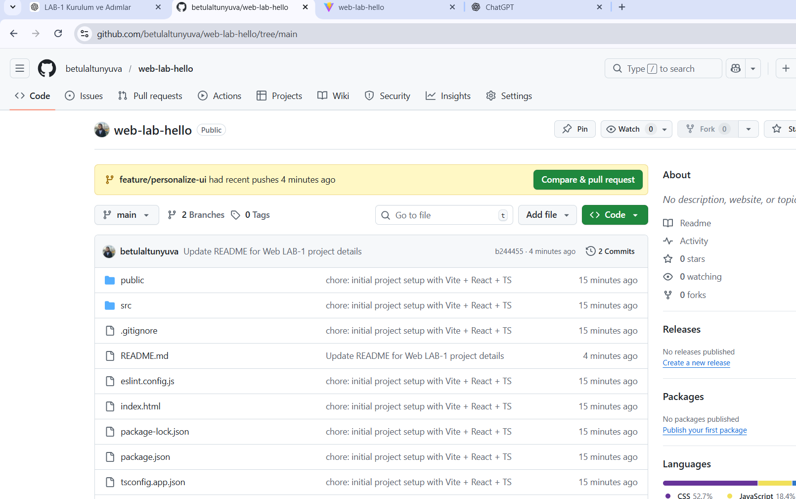

# Web LAB -1 - Hello Project

## Hakkinda
Bu proje, Web Tasarimi ve Programlama dersi LAB-1 kapsaminda 
Vite + React + TypeScript kullanilarak olusturulmustur.

## Gelistirici
- **Ad Soyad:** Betül Altunyuva
- **Ogrenci No:** XXXXX

## Kullanilan Teknolojiler
- React 18
- TypeScript
- Vite

## Kurulum
```bash
npm install

## Proje Görseli


